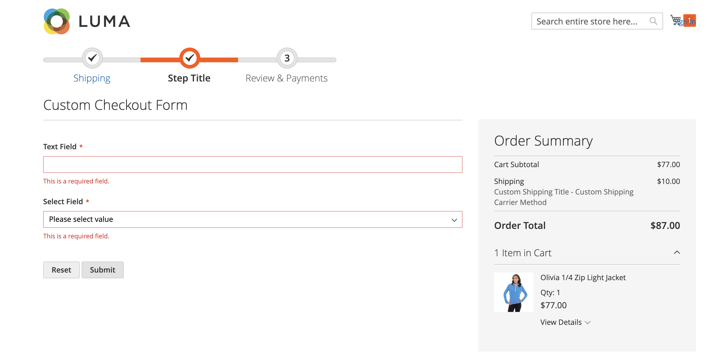

**[Home](https://supravatm.github.io/) >> [Blog](/blogs.html)**

##  {{ page.title }}


<small>
    <i class="fa-regular fa-calendar"></i> {{ page.date | date: "%b %-d, %Y" }}  &nbsp; &nbsp;
    <i class="fa-regular fa-clock"></i> {{ minutes }} min read
</small>

This topic describes how to add a custom checkout step in Checkout Page in Magento 2. its also demostraite to add a new input form (implemented as a UI component) into the custom checkout step. 



#### Key points to remember

In order to add a custom form that is a UI component, take the following steps:

- 1: [Declaration in the checkout page layout](#declaration-in-the-checkout-page-layout)
- 2: [Create the JS implementation of the form UI component](#create-the-js-implementation-of-the-form-ui-component)
- 3: [Create the HTML template](#create-the-html-template)
- 4: [Clear files after modification](#clear-files-after-modification)


#### 1: Declaration in the checkout page layout {#declaration-in-the-checkout-page-layout}

Declaring a new step and then add input form. The crosponding file is -
<span class="inlinecode">app/code/SMG/AddCheckoutStep/view/frontend/layout/checkout_index_index.xml</span>.

```xml
<page xmlns:xsi="http://www.w3.org/2001/XMLSchema-instance" layout="1column" xsi:noNamespaceSchemaLocation="urn:magento:framework:View/Layout/etc/page_configuration.xsd">
    <body>
        <referenceBlock name="checkout.root">
            <arguments>
                <argument name="jsLayout" xsi:type="array">
                    <item name="components" xsi:type="array">
                        <item name="checkout" xsi:type="array">
                            <item name="children" xsi:type="array">
                                <item name="steps" xsi:type="array">
                                    <item name="children" xsi:type="array">
                                        <!-- The new step you add -->
                                        <item name="my-new-step" xsi:type="array">
                                            <item name="component" xsi:type="string">uiComponent</item>
                                            <item name="sortOrder" xsi:type="string">2</item>
                                            <!-- <item name="component" xsi:type="string">SMG_AddCheckoutStep/js/view/my-step-view</item> -->
                                            <item name="children" xsi:type="array">
                                                <item name="custom-checkout-form-container" xsi:type="array">
                                                    <!-- Add this item to configure your js file  -->
                                                    <item name="component" xsi:type="string">SMG_AddCheckoutStep/js/view/my-step-view</item>
                                                    <item name="provider" xsi:type="string">checkoutProvider</item>
                                                    <item name="config" xsi:type="array">
                                                        <item name="template" xsi:type="string">SMG_AddCheckoutStep/custom-checkout-form</item>
                                                    </item>
                                                    <item name="children" xsi:type="array">
                                                        <!-- Here we will add the form fields  -->
                                                        <item name="custom-checkout-form-fieldset" xsi:type="array">
                                                            <item name="component" xsi:type="string">uiComponent</item>
                                                            <item name="displayArea" xsi:type="string">custom-checkout-form-fields</item>
                                                            <item name="children" xsi:type="array">
                                                                <item name="text_field" xsi:type="array">
                                                                    <item name="component" xsi:type="string">Magento_Ui/js/form/element/abstract</item>
                                                                    <item name="config" xsi:type="array">
                                                                        <!-- customScope is used to group elements within a single form (e.g. they can be validated separately) -->
                                                                        <item name="customScope" xsi:type="string">customCheckoutForm</item>
                                                                        <item name="template" xsi:type="string">ui/form/field</item>
                                                                        <item name="elementTmpl" xsi:type="string">ui/form/element/input</item>
                                                                    </item>
                                                                    <item name="provider" xsi:type="string">checkoutProvider</item>
                                                                    <item name="dataScope" xsi:type="string">customCheckoutForm.text_field</item>
                                                                    <item name="label" xsi:type="string" translate="true">Text Field</item>
                                                                    <item name="sortOrder" xsi:type="string">1</item>
                                                                    <item name="validation" xsi:type="array">
                                                                        <item name="required-entry" xsi:type="string">true</item>
                                                                    </item>
                                                                </item>
                                                                <item name="select_field" xsi:type="array">
                                                                    <item name="component" xsi:type="string">Magento_Ui/js/form/element/select</item>
                                                                    <item name="config" xsi:type="array">
                                                                        <!--customScope is used to group elements within a single form (e.g. they can be validated separately)-->
                                                                        <item name="customScope" xsi:type="string">customCheckoutForm</item>
                                                                        <item name="template" xsi:type="string">ui/form/field</item>
                                                                        <item name="elementTmpl" xsi:type="string">ui/form/element/select</item>
                                                                    </item>
                                                                    <item name="options" xsi:type="array">
                                                                        <item name="0" xsi:type="array">
                                                                            <item name="label" xsi:type="string" translate="true">Please select value</item>
                                                                            <item name="value" xsi:type="string"></item>
                                                                        </item>
                                                                        <item name="1" xsi:type="array">
                                                                            <item name="label" xsi:type="string" translate="true">Value 1</item>
                                                                            <item name="value" xsi:type="string">value_1</item>
                                                                        </item>
                                                                        <item name="2" xsi:type="array">
                                                                            <item name="label" xsi:type="string" translate="true">Value 2</item>
                                                                            <item name="value" xsi:type="string">value_2</item>
                                                                        </item>
                                                                    </item>
                                                                    <!-- value element allows to specify default value of the form field -->
                                                                    <item name="value" xsi:type="string">value_2</item>
                                                                    <item name="provider" xsi:type="string">checkoutProvider</item>
                                                                    <item name="dataScope" xsi:type="string">customCheckoutForm.select_field</item>
                                                                    <item name="label" xsi:type="string" translate="true">Select Field</item>
                                                                    <item name="sortOrder" xsi:type="string">2</item>
                                                                    <item name="validation" xsi:type="array">
                                                                        <item name="required-entry" xsi:type="string">true</item>
                                                                    </item>
                                                                </item>
                                                            </item>
                                                        </item>
                                                    </item>
                                                </item>
                                            </item>
                                        </item>
                                    </item>
                                </item>
                            </item>
                        </item>
                    </item>
                </argument>
            </arguments>
        </referenceBlock>
    </body>
</page>
```

#### 2: Create the JS implementation of the UI component {#create-the-js-implementation-of-the-ui-component}

The crosponding JS implementation of the UI component file is -
<span class="inlinecode">app/code/SMG/AddCheckoutStep/view/frontend/web/js/view/my-step-view.js</span>.

```js
define([
    'ko',
    'uiComponent',
    'underscore',
    'Magento_Checkout/js/model/step-navigator',
    'Magento_Customer/js/model/customer',
    'Magento_Ui/js/form/form'
], function (ko, Component, _, stepNavigator, customer) {
    'use strict';

    /**
     * mystep - is the name of the component's .html template,
     * <Vendor>_<Module>  - is the name of your module directory.
     */
    return Component.extend({
        defaults: {
            template: 'SMG_AddCheckoutStep/mystep'
        },

        // add here your logic to display step,
        isVisible: ko.observable(true),
        isLogedIn: customer.isLoggedIn(),

        /**
         * @returns {*}
         */
        initialize: function () {
            this._super();

            // register your step
            stepNavigator.registerStep(
                // step code will be used as step content id in the component template
                'step_code',
                // step alias
                null,
                // step title value
                'Step Title',
                // observable property with logic when display step or hide step
                this.isVisible,

                _.bind(this.navigate, this),

                /**
                 * sort order value
                 * 'sort order value' < 10: step displays before shipping step;
                 * 10 < 'sort order value' < 20 : step displays between shipping and payment step
                 * 'sort order value' > 20 : step displays after payment step
                 */
                15
            );

            return this;
        },

        /**
         * The navigate() method is responsible for navigation between checkout steps
         * during checkout. You can add custom logic, for example some conditions
         * for switching to your custom step
         * When the user navigates to the custom step via url anchor or back button we_must show step manually here
         */
        navigate: function () {
            this.isVisible(true);
        },

        /**
         * @returns void
         */
        navigateToNextStep: function () {
            stepNavigator.next();
        },

        /**
         * Form submit handler
         *
         * This method can have any name.
         */
        onSubmit: function() {
            // trigger form validation
            this.source.set('params.invalid', false);
            this.source.trigger('customCheckoutForm.data.validate');

            // verify that form data is valid
            if (!this.source.get('params.invalid')) {
                // data is retrieved from data provider by value of the customScope property
                var formData = this.source.get('customCheckoutForm');
                // do something with form data
                console.dir(formData);
                stepNavigator.next();
            }
        }

    });
});

```


#### 3: Create the HTML templates {#create-the-html-templates}

Template file for adding steps to the checkout progress bar. The crosponding JS implementation of the UI component file is -
<span class="inlinecode">app/code/SMG/AddCheckoutStep/view/frontend/web/template/mystep.html</span>.

```html
<!--The 'step_code' value from the .js file should be used-->
<li id="step_code" data-bind="fadeVisible: isVisible">
    <div class="step-title" data-bind="i18n: 'Step Title'" data-role="title"></div>
    <div id="checkout-step-title"
         class="step-content"
         data-role="content">
        <p data-bind="fadeVisible: isLogedIn"><!-- ko i18n: 'Customer logged in '--><!-- /ko --> </p>
    </div>
</li>
```
Template file for rendering input form UI  component. <span class="inlinecode">app/code/SMG/AddCheckoutStep/view/frontend/web/template/custom-checkout-form.html</span>.

```html

<li id="step_code" data-bind="fadeVisible: isVisible">
    <div class="step-title" data-bind="i18n: 'Custom Checkout Form'" data-role="title"></div>
    <div id="checkout-step-title"
         class="step-content"
         data-role="content">
        <p data-bind="fadeVisible: isLogedIn"><!-- ko i18n: 'Customer logged in '--><!-- /ko --> </p>
    </div>
    <form id="custom-checkout-form" class="form" data-bind="attr: {'data-hasrequired': $t('* Required Fields')}">
        <fieldset class="fieldset">
            <!-- ko foreach: getRegion('custom-checkout-form-fields') -->
            <!-- ko template: getTemplate() --><!-- /ko -->
            <!--/ko-->
        </fieldset>
        <button type="reset">
            <span data-bind="i18n: 'Reset'"></span>
        </button>
        <button type="button" data-bind="click: onSubmit" class="action">
            <span data-bind="i18n: 'Submit'"></span>
        </button>
    </form>
</li>
```

#### 4: Clear files after modification {#clear-files-after-modification}

If you modify your custom .html template after it was applied on the store pages, the changes will not apply until you do the following:

Delete all files in the <span class="inlinecode">pub/static/frontend</span> and <span class="inlinecode">var/view_preprocessed</span> directories.
Reload the pages.

---
#### Completed extension

The complete extension can be found on GitHub at [Add Checkout Step Module Extension](https://github.com/supravatm/magento2-sample-modules/){:target="_blank"}

#### Reference :

- [DevDocs - Add a new checkout step](https://developer.adobe.com/commerce/php/tutorials/frontend/custom-checkout/add-new-step/#step-2-add-your-step-to-the-checkout-page-layout){:target="_blank"}
- [DevDocs - Add a new input form to checkout](https://developer.adobe.com/commerce/php/tutorials/frontend/custom-checkout/add-form/){:target="_blank"}